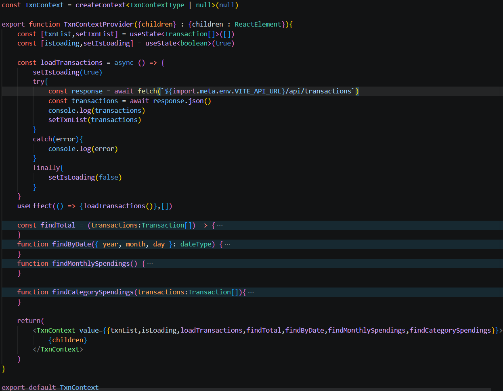
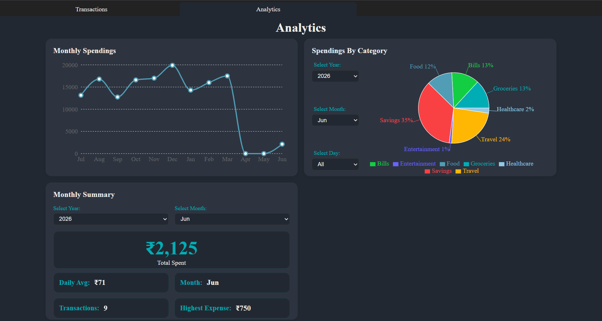
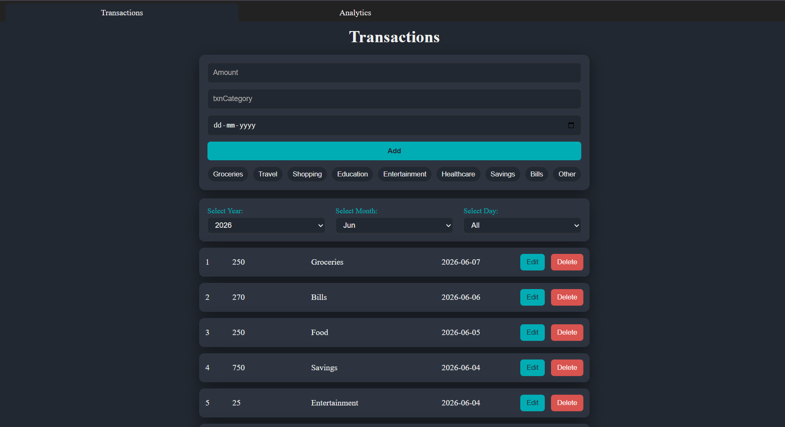
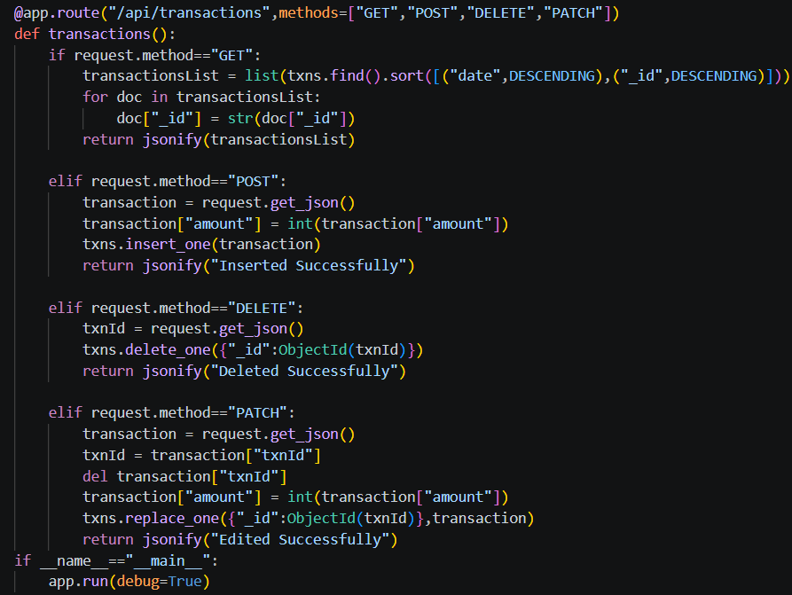

# Expense Tracker

A basic web expense management application that helps users track, organize, and analyze their financial transactions. Users can add, edit, delete, and filter transactions while gaining insights into their spending habits through interactive charts and summary statistics.

## Features

- Add, edit, and delete transactions
- Categorize income and expenses
- Filter transactions by date
- View spending analytics and summaries
- Responsive and user-friendly interface
- Persistent cloud database storage

---

## Tech Stack

### Frontend
- React
- TypeScript

### Backend
- Flask
- PyMongo
- REST API

### Database
- MongoDB Atlas

### Deployment
- GitHub Pages (Frontend)
- Render (Backend)

---

## Live Demo

Frontend: [Expense Tracker](https://vedananda-19.github.io/Expense_Tracker/)

Backend API: [Render Link](https://expense-tracker-wmjo.onrender.com/api/transactions)

---

## Project Structure

```text
Expense-Tracker
│
├── backend
│   ├── app.py
│   └── requirements.txt
│
└── frontend
    ├── Components
    ├── Analytics
    ├── Context
    ├── Layouts
    ├── pages
    ├── data
    └── src
        ├── App.jsx
        └── main.jsx
```

---

## Screenshots & Code Snippets

### React Context



*The Context Provider serves as the application's central state manager. It handles communication with the Flask backend, maintains transaction data, updates application state, and exposes reusable functions that can be accessed throughout the app.*

---

### Analytics Page



*Provides visual insights into spending patterns through charts, summaries, and financial statistics , built using the recharts library.*

---

### Transactions Page



*Allows users to create, update, delete, and filter transactions through an intuitive interface.*

---

### Backend CRUD Operations



*Flask REST API endpoints responsible for creating, retrieving, updating, and deleting transaction data stored in MongoDB.*

---

## What I Learned

- Building full-stack applications with React and Flask
- Managing global state using React Context API
- Designing and consuming REST APIs
- Integrating MongoDB with a Flask backend
- Deploying frontend and backend services independently
- Creating responsive and reusable UI components
- Visualizing data using charts and analytics


---

## Future Improvements

- User authentication and accounts
- Transaction categories and budgets
- Export transactions to CSV
- Dark/Light theme toggle
- Advanced analytics and spending trends
